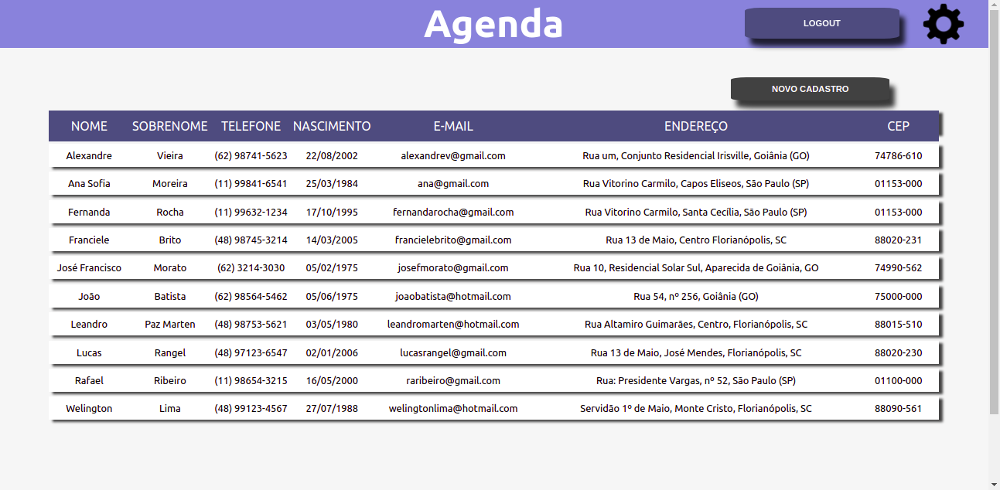

link para usar o app https://agenda-ferrari.herokuapp.com/

### A aplicação

Aplicação para fazer buscas de quadrinhos e personagens da Marvel.

Esta possui:
- página para cadastro de novo usuário.
- página de login.
- página para alteração dos dados do usuário.
- página principal da agenda de clientes.
- página para cadastro de novos cliente.

### Lançamentos Principais

Arquitetura:
- back-end: Rest,
- front-end: SOLID

Back-end:
- Criado no node com sequelize.
- Bando de dados nas nuvens em MySQL.
- Senha criptografada com hash salt usando o bcrypt.
- Token gerado com JWT.

Front-end:
- Criado no JavaScript com o Reat.
- compartilhamento de dados com o context.
- validação se o password possui mais de 6 caracteres.
- Validação se o e-mail possui um formato valido.

### Créditos
- projeto crido por Luís Ferrari
- e-mail: luisdiasferrari@gmail.com
- linkdin: https://www.linkedin.com/in/luisdferrari/
